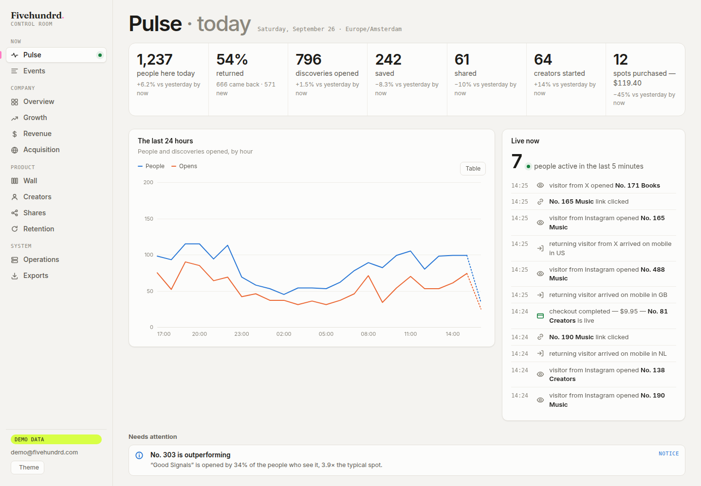

# Fivehundrd. The Wall

Production port of the approved `reference.html` prototype.

## Local development

```bash
pnpm install
pnpm dev
```

Open <http://localhost:3000>. The prepare script builds the served copy of
the approved prototype in `.generated/` (not public). `reference.html` itself
stays untouched. The copy differs from it in two ways:

- Inter and Fraunces are self-hosted from `public/fonts/` (copied from the
  `@fontsource-variable` packages) instead of loaded from Google Fonts.
- A fixture bootstrap (`scripts/fixture.js`) is inlined. With `?fixture=1` it
  freezes the clock at `2026-09-24T12:00:00Z` and seeds `Math.random`, so the
  ring entry point and "Create your story" numbers are identical on every run.

## Porting status

`/` is a Next.js page (`app/page.tsx`). The prototype has been fully moved
into typed modules and React components; no prototype script remains. The
visual suite must still match the reference after every change.

| Part | Where it lives |
|---|---|
| CSS | `app/wall/wall.css`, copied verbatim from `reference.html`, plus `app/wall/overrides/`, served as-is as one cacheable file (`/wall.css?v=<hash>`, `app/wall/styles.ts`; not through the CSS pipeline, which rewrites values) |
| Demo data, lanes, time, artwork, icons, links, images, social card | `lib/wall/*` (typed) |
| Wall order: lanes, search, ring, rows | `lib/wall/rack.ts` |
| Header, footer, tab bar, overlays | `app/wall/Chrome.tsx` |
| Lane tabs, tiles, inline panel | `app/wall/LaneNav.tsx`, `Rack.tsx`, `Tile.tsx` |
| Open spot (panel and phone sheet), per-lane blocks | `app/wall/Cover.tsx`, `SheetContent.tsx` |
| Fivehundrd card, saves, My card badge | `app/wall/Card.tsx`, `lib/wall/saves.ts` |
| Share sheet, Keep my card, toast | `app/wall/Sheets.tsx` |
| Create your story, success screen | `app/wall/Claim.tsx` |
| Preview player and demo synth | `app/wall/audio.ts` |
| Behaviour: glide, open/close, sheet ghost/drag/back, fly-to-card, tab bar, claims, minute tick | `app/wall/controller.ts` |

The controller decides what happens and hands React the state through
`app/wall/store.ts`; React renders it synchronously, so the controller can
measure and animate the new DOM straight away, as the reference did.

## Approved changes on top of the reference

The reference wins where it and the brief disagree, except for these changes,
which were signed off:

1. The open spot's countdown ticks every second (§6). The reference's stood still.
2. Closing the phone sheet leaves you exactly where you were on the wall (§7).
3. Rotating keeps the open spot open both ways: sheet to inline panel, and inline panel to sheet (§7, "and vice versa").
4. The index strip is removed. The reference only hid it, and it took no space.
5. Keep my card shows the official Google and Apple marks (§12).
6. On phones, Keep my card closes the card first, so the login sheet opens in front of it. In the reference it opened behind the card.
7. Art direction: a lighter warm off-white page, warm paper spot cards that lift off it, washed charcoal instead of screen black (the Create button most of all), and subtle grain and halftone on cards and artwork. Layout, sizes, spacing and hierarchy are unchanged.
8. On phones an open spot is an overlay above the wall that grows out of its tile and shrinks back into it, with room around it to tap to close. The wall never moves behind it; ×, a tap outside, Escape, a downward drag and the back gesture all close it.
9. One spot everywhere: the Create preview shows the wall's own tile (`SpotTile`, the same component and styles as the wall) above the opened view.
10. Share cards are built around that same tile, in Story (1080×1920), Square (1080×1080) and Wide (1200×630), and replace the reference's hand-drawn canvas card on the Done screen. Share goes straight to the native share sheet with the card and link where the phone can share files; otherwise the share sheet offers the card, save, copy image, copy link and "For Instagram & TikTok".
11. Screens redesigned by these changes (Create, the Done screen, the share sheet) are compared against approved baselines of the app itself (`tests/__baselines__/…/approved/`, committed; `pnpm test:approve` rewrites them after a signed-off change), still at zero tolerance.
12. Mobile audit (phones and tablets): Back closes whatever is open (a spot, Finds, Create, Share, Report, Keep my card), top one first; sheets open above the tab bar and above an open spot; the tab bar reads **Wall / Finds / Create**; a compact phone header (brand and a search button, lanes with 44px tabs); every control at least 44px; a one-line introduction on a first visit; Create in six steps (lane, artwork, name, description, links, preview and pay) with the wall's own tile filling in beside each question.
13. Phone performance: rows out of view skip layout and paint (`content-visibility`), tile patterns are images instead of inline SVG (25k → 11k elements), the wall is built a few rows at a time, the spot overlay animates with transform and opacity only, and phones use tints instead of blur and blend modes. All phone and tablet screenshots are approved baselines; desktop still matches the reference pixel for pixel.
14. Craft pass, part 1 (tile, time, interaction, opening, Timeheart):
    - **The tile says less.** Art, name and time left. The opens pill is gone from the tile (it stays in the markup for the counters), the saves count is quiet ink with a heart, and inside one lane the lane label is not repeated.
    - **Time is a material.** Each spot has a phase (`lib/wall/time.ts`, `phase()`), carried as `data-phase` on the tile:
      - *rising*, its first 3 hours: the new dot gets a soft halo;
      - *live*;
      - *last*, its final 6 hours: time to the minute on a printed ink/lime label and a breathing time bar. The maker's artwork is never altered. No red.
    - **The wall answers the pointer.** A small lift with the tile's own slight lean, the artwork shifting a few pixels against the pointer (`app/wall/feel.ts`), the number chip inking in, the time bar thickening, and a press that gives and springs back.
    - **Opening on desktop.** The tile's artwork flies into the panel (`morphOpen` in the controller, 380ms), the panel unfolds down from its notch and the text settles in line by line. Automatic opens and resizes don't fly.
    - **Save is the Timeheart.** "Timeheart" is the action and "Kept" the completed state, everywhere visitors see it (wall, Finds, toasts, info pages, FAQ, emails). Downloading a share card says "Download". The heart has a clock's hands in it. Giving one beats twice, sweeps the hands a full turn, sends one ring out in the lane colour, and makes the time left, the tile's time bar and its count answer. It is the same save underneath: Finds, the counters and the Keep my card flow are unchanged.
    - **Rhythm.** Hotspots with real activity behind them are big (2×2). Big spots are rare: at most `BIG_MAX` (6), and only with at least `BIG_MIN_OPENS` (25) opens and `BIG_MIN_KEPT` (5) Timehearts in the Hotspot window, so a few early visits on a quiet wall never make one (`lib/wall/hot.ts`, `bigSpots`). They read like a feature: a Hotspot kicker, a bigger name, and their line in Fraunces. They keep the circle's order and stay at least three lines apart (`lib/wall/rack.ts`). Open spots side by side are one quiet slot ("No. 139–140"), and the price only speaks up on hover. Phones show two columns (below a 453px screen), with names on up to two lines and every tile the same height, checked at 320, 375, 390 and 430px.
    - **Finds are your history.** They read leaving first or as you found them (remembered per device), three to a row, with their line of history as the caption. An ended find is stamped.
    - **Phones and Create.** Create is a lime disc in the tab bar. The Create sheet says "Put it on the wall." and "Place it · $9.95 for 72 hours".
    - **Screenshots.** Every state, desktop included, compares at zero tolerance against the approved baselines, which are frozen regression baselines. `pnpm test:approve` refuses to rewrite them unless run as `APPROVE=yes pnpm test:approve`, after a signed-off visual change. Multi-line text in the desktop card used to render one of two ways from run to run (the card is its own scroll container, and Chromium didn't always give it a layer); the card now always has one (`will-change`), and the text is compared like everything else. `tests/craft.spec.ts` covers phases, pointer, flight, Timeheart, reduced motion and keyboard. With reduced motion nothing moves; only the state changes.
15. Scout (docs/scout.md), approved 2026-09-28:
    - The Fivehundrd card is the **Scout Card** and Finds are **Scouts**.
    - **Signed out**, the card says what signing in is for. After a Timeheart, one quiet line says it too, at most once a day: "Scout this? Sign in to remember you found it early." (the words since item 16).
    - **Signed in**, the card shows:
      - where you stand: "Building your Scout history", "Scout", or "Top 8% · Silver Scout" once tiers are active;
      - your Scouts, Early Calls and Hotspots;
      - your strongest call;
      - "Share Scout Card".
    - The outline is the tier's ink: warm gold, steel or copper, never shiny. A tier move is said once, on the next visit.
    - **Call it is gone:** the Timeheart is the call.
    - **Data:** `supabase/migrations/20260928090000_scout.sql`, API under `app/api/scout/*`, and a nightly recalculation (`/api/cron/scout`).
    - **Review fixes:**
      - `…095000_scout_unsave`: letting go on another device.
      - `…110000_scout_flags_at`: checks at the moment of the call, burst only over signed-in calls, one timestamp per Timeheart.
      - `…120000_scout_shared_ip`: a shared address only counts together with co-ordination.
    - **Public pages:** shared cards at `/scout/[slug]` and single Early Calls at `/scout/[slug]/[story]`, each with its own link image. They are not indexed.
    - **Tests:** `db/scout.test.mjs`, `lib/wall/scout.test.mjs` and `tests/scout.spec.ts`.
16. The copy pass (docs/copy.md), approved 2026-09-28:
    - **Words:** they live in one module, `lib/site/copy.ts`, with one locked vocabulary.
    - **First visit:** the first screen shows:
      - "Find what’s next. Before everyone else does.";
      - today's real numbers (`public.today_public()` via `/api/today`), or none;
      - the loop in three steps.
    - **Returning visitors** (after a Timeheart, or signed in) start on the wall.
    - **Scout Card:**
      - the signed-out explainer ("Think you know what’s next? Prove it.", the tiers, "Start Scouting");
      - the empty state and the promotion;
      - "Your Wall Today", with real reasons only.
    - **Open Spots** say "Put something worth finding here. Claim this spot".
    - **Create** reads "Put it on the Wall." and "Place it · $9.95".
    - **The header** says "Claim a spot".
    - **Data:** `supabase/migrations/20260928100000_copy.sql`. **Tests:** `tests/copy.spec.ts`.
17. Phones, approved 2026-09-29: in an open spot, **Share · Timeheart · Next spot** stay in reach. The row sticks to the bottom of the overlay while the story scrolls under it, and settles into its place after the links. Desktop and tablets are unchanged; the row is one line down to 320px, every button 44px tall.
18. The Hotspots / Newest rail, approved 2026-09-29: each card in a frame like a printed museum label. A thin outer line with its top left corner cut, a margin of paper, and an inner line in the artwork's own colour. Cards keep their size; hover and focus lift them 3px. Wall tiles are unchanged.
19. Approved 2026-10-01, from the founder's review of the site:
    - **Nothing opens by itself.** The wall starts with every spot closed, on every screen; a lane or a search opens nothing either. A spot opens when someone taps it, or through a link to it (`#217`, a shared `/s/…` link). The reference opened its entry spot; desktop screenshots that showed it are re-approved.
    - **Less copy:** the card's "The wall is a circle…" line, the price and time under an Open Spot's tile (the live wall keeps its lane name there; Create still says the price), and "No follower count required." in Create are gone.
    - **Report has one place:** Report a spot, at the bottom of every page (lane and spot number). The Report button on stories and the report sheet are gone.
    - **Questions** open and close one at a time (`details`); the answers stay in the page and in its FAQ structured data.
    - **Favicon:** the wordmark's F in Fraunces with its pink dot, cream on charcoal (`app/icon.svg`, `app/favicon.ico`, `app/apple-icon.png`).
20. Audit fixes, 2026-10-01: the phone tab bar's inactive tabs are darker (they failed contrast), and the footer's lane list is called "All lanes" for screen readers (two navigations were both "Lanes").
21. Speed pass, 2026-10-01 (no pixel changes once the wall is in):
    - **Every screen** builds the wall a few rows at a time while the browser is idle, as phones did (two rows a step on phones). Each step renders only the rack (the row limit has its own store), rows already built don't render again, and the wall's start renders once instead of about ten times. Desktop keeps its inline tile patterns: as images (like phones) they'd halve its elements, but their edges anti-alias a little differently, so that is a visual change to approve first.
    - **Nothing jumps while it loads**: until the wall is in, the Scout card and the footer under it wait unseen (`overrides/16-speed.css`), and the first screen's fonts are fetched with the page.
    - **Lighter page**: the CSS is one cacheable file instead of inline (it was in every page twice, in the HTML and in React's payload: 57 → 9 KB compressed HTML), and the wall's scripts come with the page instead of a round trip later.
    - Measured on a production build without a database (the demo wall), compressed as Vercel serves it, phone on slow 4G with a 4× slower CPU: the wall in 3.6 s instead of 4.1, blocked time 0.85 s instead of 2.8, layout shift 0.17 instead of 0.29. Desktop: the wall in 0.46 s instead of 1.3, blocked 0.1 s instead of 0.9, layout shift 0.03 instead of 0.68. What still shifts is the first screen's "today" block giving up its numbers' room when there is no database; with one, the numbers fill that room.
22. Makers after their 72 hours, approved 2026-10-02: "Your story" on the card shows the spot's final numbers and **Put it on again**, which opens Create with the same story ready to place (a new spot and 72 hours, paid again). In the site itself, no email (`overrides/17-maker-again.css`, docs/retention.md).
23. The Scout card, calmer, approved 2026-10-02: no "You walked in at · Take me back" block (`overrides/18-card-calmer.css` hides it in the reference too). The wall still starts at the visitor's entry spot.
24. Free spots while the wall fills, approved 2026-10-03: without `NEXT_PUBLIC_PAYMENTS=on`, Create's button reads **Live now**, a placed story goes live at once (`free_place`: the same checks, amount 0, at most three free spots on the wall per address) and the site says "free for now" instead of a price. Stripe stays as it is; set `NEXT_PUBLIC_PAYMENTS=on` and redeploy to charge. The visual tests build with it on, as the reference shows the price.

CSS for these lives in `app/wall/overrides/`, one file per part, joined in order (`app/wall/overrides/index.ts`). The visual suite applies it
to the reference too, so the baselines are "the reference plus the approved
changes". Behaviour tests for them run on the app only, with the reason given.

## Deploying

`vercel.json` pins the framework to Next.js. The Vercel project was created
before the app existed, when it was a plain HTML repository, so it would
otherwise build with the "Other" preset and serve only `public/`, which gives
a 404 on `/`.

## Database

Supabase (Postgres, Auth, Storage, Cron). The schema is
`supabase/migrations/`: 500 spots per lane keyed by `(lane, no)`, stories,
saves, events, and the functions the app calls (`wall_public`, checkout,
webhook, events). Visitors can only read the public wall; everything that
changes it goes through the server, which proves itself with a key kept in
Supabase Vault. The live teaser tables (`early_access_signups`,
`early_access_events`) live in the same project and are left untouched.

`pnpm test:db` runs the schema on an in-process Postgres (PGlite) with
Auth, Vault and the API roles stubbed.
`pnpm test:unit` covers the live wall's layout (`lib/wall/live.ts`).

## The live wall

With the Supabase variables set, `/` is the live wall: every live story
first, taking turns lane by lane, then open spots until the wall holds 500.
Without them (and always with `?demo=1` or `?fixture=1`) it is the demo wall
from the reference. A story's address is `/s/{lane}/{no}/{code}`, e.g. `/s/music/217/k3f9x2ab`.
The code belongs to the story, so a shared link keeps working after its 72
hours, when No. 217 has a new holder: while it's live the link opens the wall
at the story; afterwards it shows the story as it was (the same open view,
aged), where to find its maker, and the way to the wall. `/s/{lane}/{no}`
opens whoever holds that number now. Link previews (X, WhatsApp, iMessage)
are drawn on the server as the Wide card, from the same data, colours,
pattern and fonts (`opengraph-image.tsx`), since those platforms can't run
the wall.

| Route | What it does |
| --- | --- |
| `GET /api/wall` | live stories and held numbers, cached 15 s at the edge |
| `POST /api/checkout` | checks the claim, holds the number for 30 minutes, opens Stripe Checkout ($9.95) |
| `GET /api/checkout/status` | where a checkout stands, for the page Stripe returns to |
| `POST /api/checkout/cancel` | the maker backed out: ends the session, frees the number |
| `POST /api/stripe/webhook` | paid → live for 72 hours; expired or failed → number free |
| `POST /api/events` | opens, saves, shares, link clicks, entries |
| `POST /api/uploads` | a one-time upload link for a draft file (15 an hour per person) |
| `POST /api/reports` | a visitor reports a story |
| `GET/POST /api/admin` | the admin screen's data and actions |
| `GET /api/cron/cleanup` | daily: removes draft uploads nobody paid for |

Media is uploaded from the browser to Storage (`art`, `audio`, under
`pending/`) through one-time links the server hands out, before paying. Keep my card uses Supabase Auth: an email link
always; Google and Apple once they are switched on under Authentication →
Providers.

Environment variables (Vercel → Settings → Environment Variables):

| Variable | Where it comes from |
| --- | --- |
| `NEXT_PUBLIC_SUPABASE_URL` | Supabase project URL |
| `NEXT_PUBLIC_SUPABASE_PUBLISHABLE_KEY` | Supabase → API keys → publishable |
| `FIVEHUNDRD_SERVER_KEY` | the Vault secret `fivehundrd_server_key` |
| `NEXT_PUBLIC_PAYMENTS` | `on` to charge for spots through Stripe; unset, spots are free and go live at once |
| `STRIPE_SECRET_KEY` | Stripe → Developers → API keys |
| `STRIPE_WEBHOOK_SECRET` | the webhook endpoint for `/api/stripe/webhook` |

Optional, for keeping the wall safe (each is skipped when unset):

| Variable | What it does |
| --- | --- |
| `SUPABASE_SECRET_KEY` | upload links and the daily clean-up (needed for uploads) |
| `ANTHROPIC_API_KEY` | the automatic check of names, texts and images before payment |
| `GOOGLE_SAFE_BROWSING_KEY` | checks links against Google's list of harmful sites |
| `NEXT_PUBLIC_TURNSTILE_SITE_KEY`, `TURNSTILE_SECRET_KEY` | Cloudflare's invisible robot check before paying |
| `ADMIN_EMAILS` | who may open `/admin` (comma separated) |
| `CRON_SECRET` | lets Vercel's daily clean-up and scheduled reports in |
| `NEXT_PUBLIC_SITE_URL` | the public address for canonical links, sitemap and structured data (default `https://fivehundrd.com`) |
| `NEXT_PUBLIC_CONTACT_EMAIL` | the address in the footer and on Contact (default `hello@fivehundrd.com`) |
| `FOUNDER_EMAILS` | who may open the Control Room, `/founder` (falls back to `ADMIN_EMAILS`) |
| `FOUNDER_SESSION_SECRET` | signs Control Room sessions (otherwise derived from the server key) |
| `FOUNDER_TZ` | where the Control Room's days begin (default `Europe/Amsterdam`) |
| `FOUNDER_SINCE` | the first day of "All time" (default `2026-09-01`) |

The webhook listens for `checkout.session.completed`,
`checkout.session.async_payment_succeeded`, `checkout.session.expired`,
`checkout.session.async_payment_failed` and `charge.dispute.*` (chargebacks),
and records Stripe's fee for each payment.

## The site around the wall (SEO and answer engines)

- The footer says what Fivehundrd is and links to real pages: How it works,
  Pricing, Wall rules, Questions, About, Contact, Terms, Privacy
  (`app/(site)/[page]`, copy in `lib/site/pages.tsx`), and to each lane's
  own address, `/lanes/music` … (the wall, opened on that lane).
- All facts come from one file, `lib/site/facts.ts`: the footer, pages,
  JSON-LD (Organization, WebSite, Service with the $9.95 offer, FAQPage,
  breadcrumbs), `/sitemap.xml` (with live stories' lasting links),
  `/robots.txt` (keeps `/founder`, `/admin` and `/api` out) and `/llms.txt`.
- A story's lasting link (`/s/music/217/k3f9x2ab`) has its own title,
  description, preview image, canonical address and CreativeWork JSON-LD.
  While it's live the page is the wall, which opens the story once its
  scripts run; the page as sent also carries the story's own words and its
  maker's links, visually hidden like the page's heading (`StoryText` in
  `app/wall/WallPage.tsx`), so search engines and screen readers get them
  straight away.
- Makers pay for their spot, so their links are paid links:
  `rel="sponsored"` everywhere they appear (Google's rules for paid links).
- Terms and Privacy describe what the code does; have them checked by a
  lawyer before launch.

## The Control Room (`/founder`)

The founder's private analytics product: Pulse (today, live), Overview,
Growth, Wall, Creators, Revenue, Acquisition, Shares, Retention, Operations,
Events, Exports, and a page per spot. Blueprint, metric definitions and alert
rules: [`docs/founder-dashboard.md`](docs/founder-dashboard.md).

- Its own root layout, styles and code (`app/(founder)`); the public site
  lives in `app/(site)` and never loads any of it.
- Every number comes from `fd_*` database functions that need the server
  key, called only on the server. Sign-in is a Supabase email link; the
  server checks `FOUNDER_EMAILS` and sets its own signed, httpOnly cookie.
- The wall measures anonymously: one beacon per visit (source, device,
  country), batched impressions, Create steps and errors (`app/wall/track.ts`
  → `/api/track`); API routes log status and timing after responding.
- Exports (CSV, XLSX, PDF founder report) run as server jobs into the private
  `exports` Storage bucket (created on first use). Scheduled reports:
  `/api/cron/reports?kind=daily|weekly|monthly` (see `vercel.json`).
- To look around without data: `FOUNDER_DEMO=1 pnpm dev`, then open
  `/founder`. The demo is made up, needs no sign-in, and is refused when
  `VERCEL_ENV=production`.



## Keeping the wall safe

- **Before payment** every story is checked: links against simple rules (no
  short links, bare server addresses or hidden logins) and Google Safe
  Browsing; the name, texts and images by Claude. Clear violations are
  refused before any money moves; doubtful ones go live and wait on the
  admin screen.
- **Reports**: one place, Report a spot at the bottom of every page (approved
  2026-10-01): a lane and a spot number. Three people reporting a story take
  it off the wall until a person looks; each report is mailed to
  `ADMIN_EMAILS` when Resend is set up, and listed on /admin either way.
- **Limits**: one person holds at most 3 spots at once and starts at most 10
  checkouts an hour; 15 uploads an hour; an invisible robot check before
  paying. Uploads nobody paid for are removed daily.
- **Hotspots can't be bought with scripts**: one address counts as at most
  three people per story, the maker's own address not at all, and one
  address records at most 1,500 events an hour (`private.hotspot_cfg()`).
- **Headers**: other sites can't frame Fivehundrd (clickjacking), no type
  sniffing, no full addresses to other sites, no camera, microphone or
  location, HTTPS only (`next.config.ts`). Scripts aren't restricted by a
  Content Security Policy yet: that needs nonces for the inline ones.
- **No spot, no charge**: a payment for a story that was taken off the wall
  (or let go) before it went live is refunded automatically.
- **`/admin`**: live stories, what needs a look, reports, takings per day,
  week and month; hide, keep, remove, refund. Sign in with an email link;
  only `ADMIN_EMAILS` get in.

## Checks

```bash
pnpm lint
pnpm test:db
pnpm test:unit
pnpm build
pnpm exec playwright install chromium
pnpm test:e2e
```

`pnpm test:e2e` runs two Playwright projects:

1. `reference` renders `/reference.html?fixture=1` and writes the baselines
   (`pnpm test:baseline`).
2. `app` renders `/?fixture=1` and compares it against them
   (`pnpm test:visual`).

Both run at 390×844, 700×900 and 1400×900, in light and dark mode, for every
state in BUILD_BRIEF §1.3, against the production build. The allowed
difference is 0 pixels. Baselines are regenerated from the reference on each
run and are not committed.

`tests/behaviour.spec.ts` checks what screenshots cannot see (§6, §7, §17):
the sheet's open and close paths (×, backdrop, Escape, back, drag, flick),
Next spot in place, Save, deep links, rotation, the ghost animation and
reduced motion. It runs on both projects, and both must pass.

To use an already installed Chromium instead of Playwright's download, set
`CHROMIUM_PATH=/path/to/chrome`.
